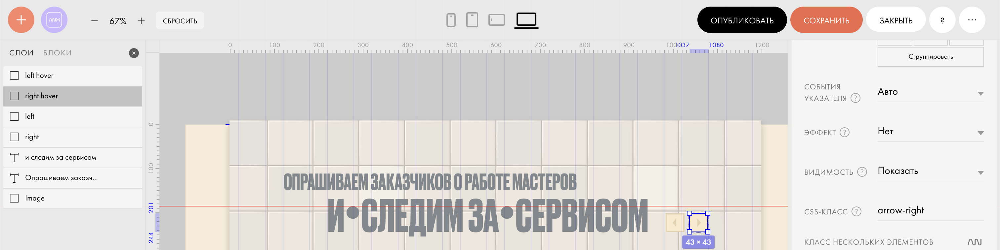
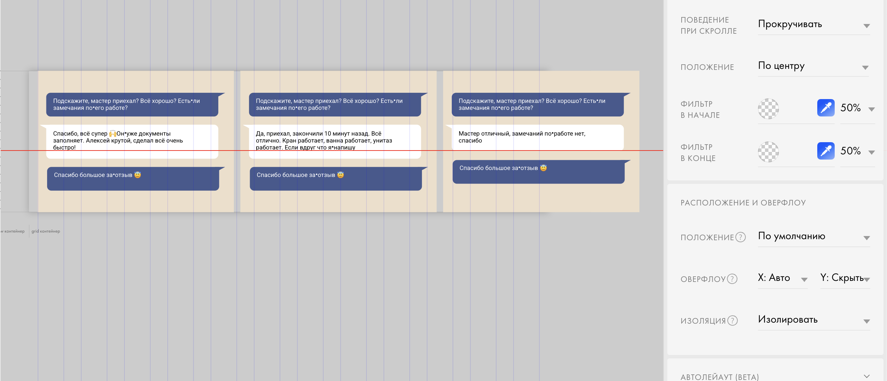

# Custom SwipeTrack Module for a Tilda Website with Arrows

## Описание
Кастомный модуль свайпа для сайтов на платформе **Tilda**, позволяющий создавать слайдер с удобной навигацией стрелками. Модуль расширяет стандартный функционал Tilda, добавляя плавную прокрутку и управление с помощью кнопок.

## Функционал
- Горизонтальный свайп-контейнер с несколькими элементами
- Навигация по слайдам с помощью стрелок "влево" и "вправо"
- Поддержка адаптивного дизайна
- Лёгкая интеграция в любые страницы Tilda через вставку скриптов и стилей

## Технологии
- JavaScript (ES6+)
- CSS3
- Платформа Tilda (внедрение кастомных модулей)

### Визуальный пример

*На этом скриншоте показано, как в редакторе Tilda добавляются стрелки навигации и присваиваются классы `arrow-left` и `arrow-right` для управления слайдером.*

---

*Здесь видно, как в редакторе создаётся блок с прокручиваемыми элементами (карточками), и для него задаётся CSS-свойство `overflow: auto` для горизонтальной прокрутки.*
